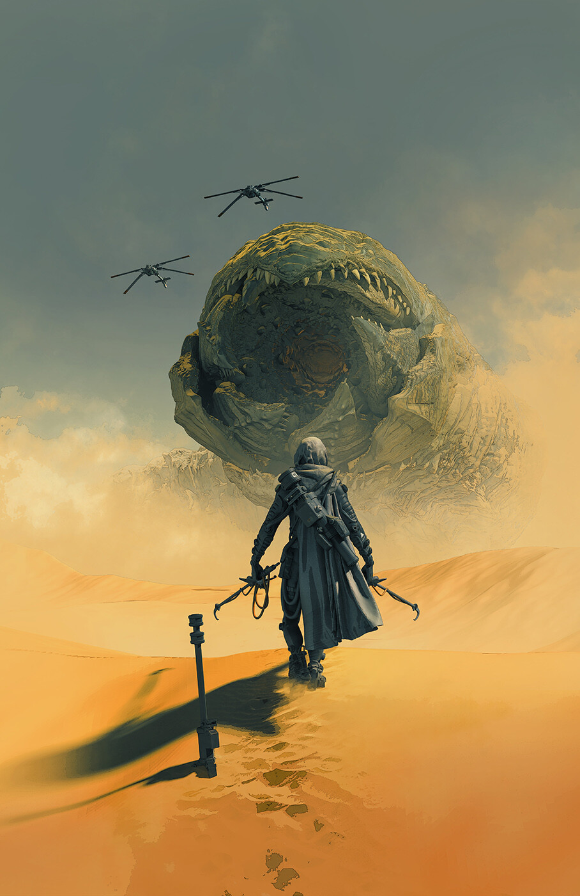
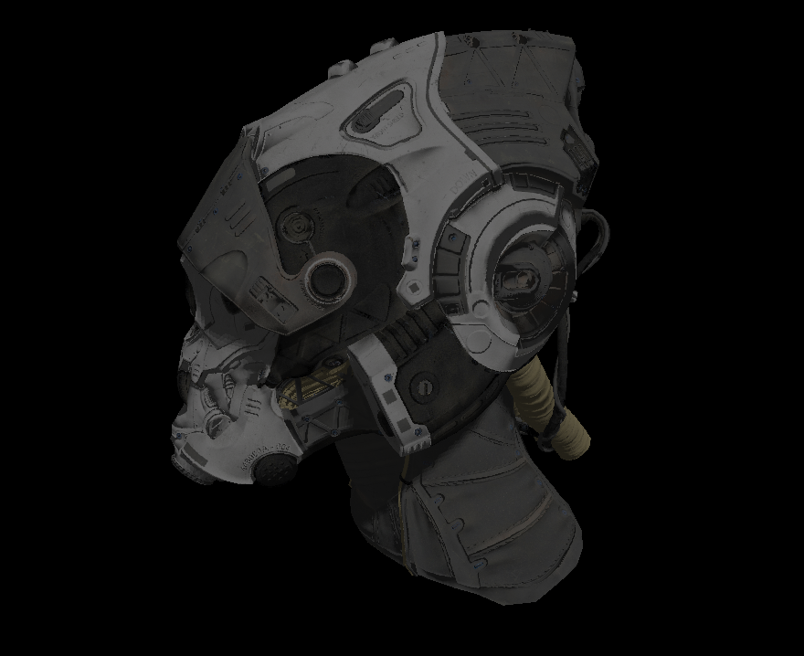

// template from https://github.com/othneildrew/Best-README-Template/blob/master/README.md?plain=1

<!-- PROJECT LOGO -->

 

    

  <h3 align="center">Dune Inspired Game</h3>

  

    This is a game I am developing inspired by Dune! It will hopefully be a mix of Dune and Temple Run. This is for education purposes.
     
  

<!-- TABLE OF CONTENTS -->

  
Table of Contents

  <ol>
    <li><a href="#about-the-project">About The Project</a></li>
    <li><a href="#features">Features</a></li>
    <li><a href="#roadmap">Roadmap</a></li>
    <li><a href="#demo">Demo</a></li>
    <li><a href="#contact">Contact</a></li>
  </ol>

<!-- ABOUT THE PROJECT -->
## About The Project

Having watched Denis Villeneuve's take on Dune in Dune Part 1 and Part 2 was very inspiring.  The vast deserts of Arrakis seemed otherwordly and real. Moreover, having read Dune and Dune Messiah, the rise and fall of Paul has shaped my perspective on science fiction and literature. After consuming my dosage of this amazing story, I thought it would be an excellent way for me to apply and learn computer graphics while creating something relevant to an universe I am fascinated by. Hence this project is aimed at creating a Dune inspired game with stylized graphics. For the art style, I am hoping to achieve something similar to Sonic Unleashed. In terms of gameplay, it will be based on Temple Run as the primary concern will be programming an engine with modern computer graphics practices and not game design as much. The environment will of course be based on Dune. 

(<a href="#readme-top">back to top</a>)

### Features

<ul>
    <li>Spotlights</li>
    <li>Directional lighting</li>
    <li>Light Probe Global Illumination</li>
    <li>Normal Mapping</li>
    <li>PBR Rendering</li>
    <li>Pixel Perfect Editor Object Selection</li>
</ul>

(<a href="#readme-top">back to top</a>)

<!-- ROADMAP -->
## Roadmap

Currently the roadmap is being logged in a <a href="https://trello.com/b/SyJ3Bqbe" target="_blank">Trello</a>!

(<a href="#readme-top">back to top</a>)

<!-- CONTRIBUTING -->
## Demo

These are videos and images of what the engine can do currently! 

 
 

(<a href="#readme-top">back to top</a>)

<!-- CONTACT -->
## Contact

Sarthak Kamboj - sarthakkamboj22@gmail.com

Project Link: [https://github.com/SarthakKamboj/Inu_3D_Renderer](https://github.com/SarthakKamboj/Inu_3D_Renderer)

(<a href="#readme-top">back to top</a>)

